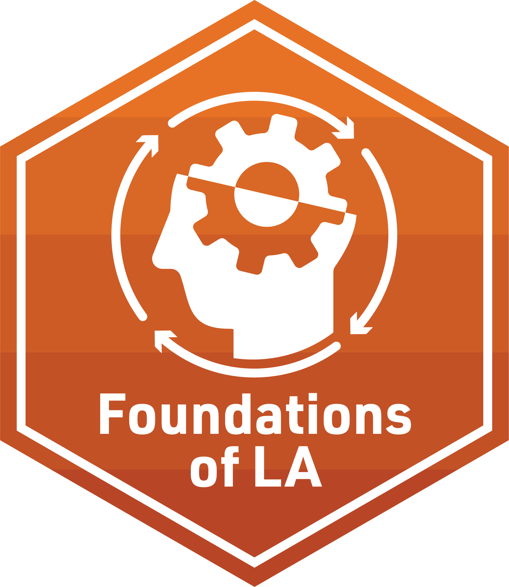
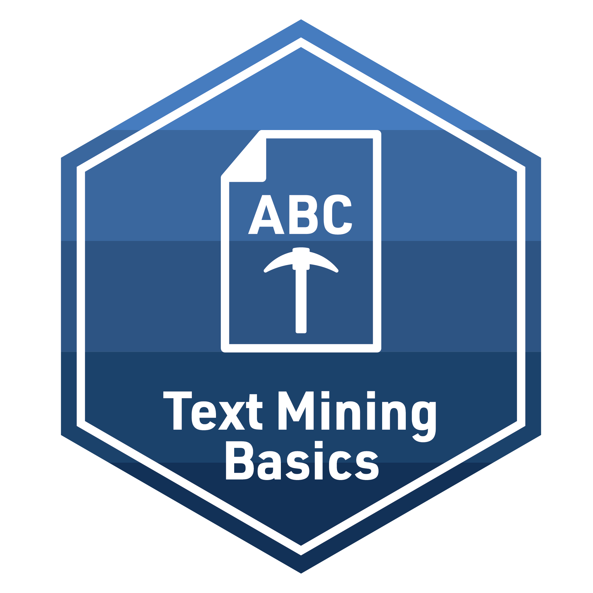

```{r setup, include=FALSE}
knitr::opts_chunk$set(echo = TRUE)

```

# LASER Badges

The LASER Institute Badges are stickers earned for completing the independent analyses and capstone projects associated with the learning labs for each topic area covered in the summer workshop. The descriptions below provide a brief overview of the conceptual knowledge and skills demonstrated when earning each badge.

## Orientation

{width="145px"}

This badge is earned for completing the LASER orientation learning lab badge requirement covering the concepts of open science and reproducible research for application to learning analytics using R, R Studio, and GitHub Desktop.

## Foundational Skills

{width="145px"}

The primary Foundational Skills badge is earned by completing the capstone project which covers the skills gained in the following 4 learning labs.

### 1. Data Sources in Learning Analytics

{width="145px"}

This badge is earned for completing the first Foundations learning lab badge requirement on the types of data typically used to perform learning analytics in education. 

### 2. The Learning Analytics Workflow

{width="145px"}

This badge is earned for completing the second Foundations learning lab badge requirement on the Learning Analytics workflow.


### 3. Data Visualization

{width="145px"}

This badge is earned for completing the third Foundations learning lab requirement on the basic principles of data visualization as it relates to data graphics, including data visualization perception and color.

### 4. Data Products

{width="145px"}

This badge is earned for completing the fourth Foundations learning lab badge requirement on the essentials of crafting a data product for different stakeholders.

## Text Mining

{width="145px"}

The primary Text Mining badge is earned by completing the capstone project which covers the skills gained in the following 4 learning labs.

### 1. Text Mining Basics

{width="145px"}

This badge is earned for completing the first Text Mining learning lab badge requirement which covers getting our text “tidy” so we can perform some basic word counts, look at words that occur at a higher rate in a group of documents, examine words that are unique to those document groups, and create visualizations such as word cloud.

### 2. Dictionary Methods

{width="145px"}

This badge is earned for completing the second Text Mining learning lab badge requirement which covers dictionary-based text mining techniques and sentiment analysis. 

### 3. Topic Modeling

{width="145px"}

This badge is earned for completing the third Text Mining learning lab badge requirement identifying “topics” by examining how words cohere into different latent, or hidden, themes based on patterns of co-occurrence of words within documents.

### 4. Text Classification

{width="145px"}

This badge is earned for completing the fourth Text Mining learning lab badge requirement which covers using text classification to build predictive models for intelligent systems.

## Social Network Analysis

{width="145px"}

The primary Social Network Analysis badge is earned by completing the capstone project which covers the skills gained in the following 4 learning labs.

### 1. Introduction to Social Network Analysis

{width="145px"}

This badge is earned for completing the first Social Network Analysis learning lab which shows a general understanding of key SNA concepts and terminology, as well as a basic comfort level with representing networks visually.

### 2. Network Measurement

{width="145px"}

This badge is earned for completing the second Social Network Analysis learning lab which shows skills developed in the collection, management, and measurement of network data.

### 3. Group & Egos

{width="145px"}

This badge is earned for completing the third Social Network Analysis learning lab which shows the ability to employ the methods and measures for analyzing groups, positions, and individual actors.

### 4. Models & Inference

{width="145px"}

This badge is earned for completing the fourth Social Network Analysis learning lab which shows the development of the ability to make predictions from social network data and test hypotheses about a network of interest.

## Machine Learning

{width="145px"}

The primary Machine Learning badge is earned by completing the capstone project which covers applying the skills from the four machine learning labs via an independent analysis of a self-identified data source.

### 1. Prediction

{width="145px"}

This badge is earned for completing the first Machine Learning learning lab which shows that scholars can apply supervised machine learning to automate or scale up the relationships between predictor (independent) and outcome (dependent) variables.

### 2. Feature Engineering

{width="145px"}

This badge is earned for completing the second Machine Learning learning lab which shows the ability to engineer and include features in a model and examine the models' predictive performance using cross-validation.

### 3. Model Tuning

{width="145px"}

This badge is earned for completing the third Machine Learning learning lab which shows skills necessary to specify tuning parameters and choosing between simple or complex models for prediction.

### 4. Unsupervised Methods

{width="145px"}

This badge is earned for completing the fourth Machine Learning learning lab which shows the ability to employ unsupervised machine learning methods such as latent profile analysis as a way of estimating groups on the basis of a set of predictor variables.
