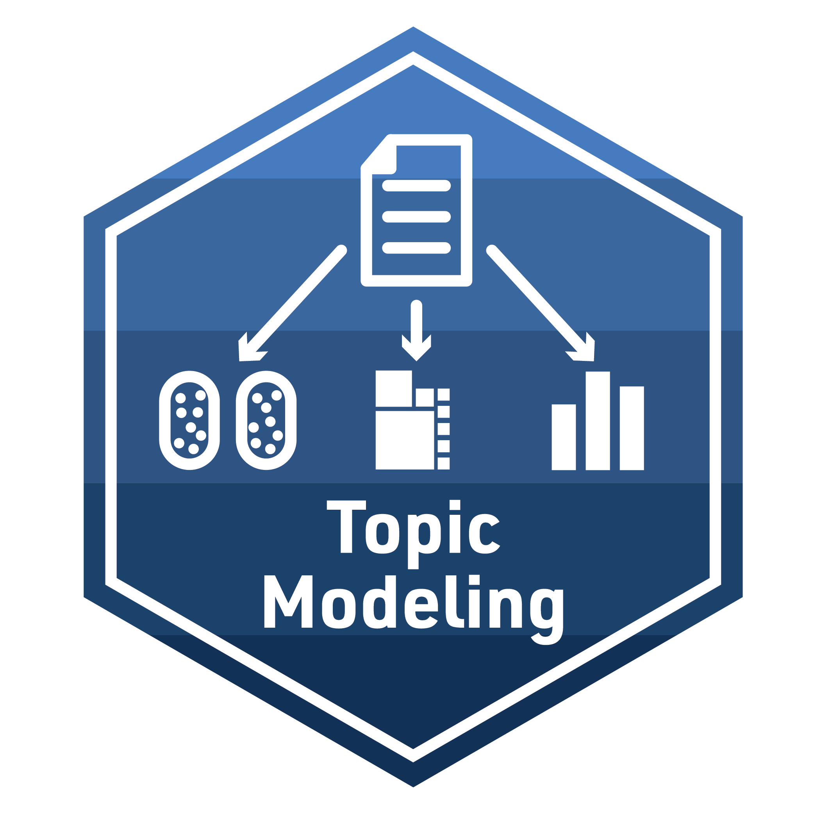

```{r setup, include=FALSE}
knitr::opts_chunk$set(echo = TRUE)

```

# LASER Badges

## Orientation

{width="145px"}

### Reproducible Research

{width="145px"}

## Foundational Skills

{width="145px"}

### 1. Data Sources in Learning Analytics

{width="145px"}

### 2. The Learning Analytics Workflow

{width="145px"}


### 3. Data Visualization

{width="145px"}

### 4. Data Products

{width="145px"}


## Text Mining

{width="145px"}

### 1. Text Mining Basics

{width="145px"}

### 2. Dictionary Methods

{width="145px"}

### 3. Topic Modeling

{width="145px"}

### 4. Text Classification

{width="145px"}

## Social Network Analysis

{width="145px"}

### 1. Introduction to Social Network Analysis

{width="145px"}

### 2. Network Measurement

{width="145px"}

### 3. Group & Egos

{width="145px"}

### 4. Models & Inference

{width="145px"}

## Machine Learning

{width="145px"}

### 1. Prediction

{width="145px"}

### 2. Feature Engineering

{width="145px"}

### 3. Model Tuning

{width="145px"}

### 4. Unsupervised Methods

{width="145px"}

# Scholar Accountability